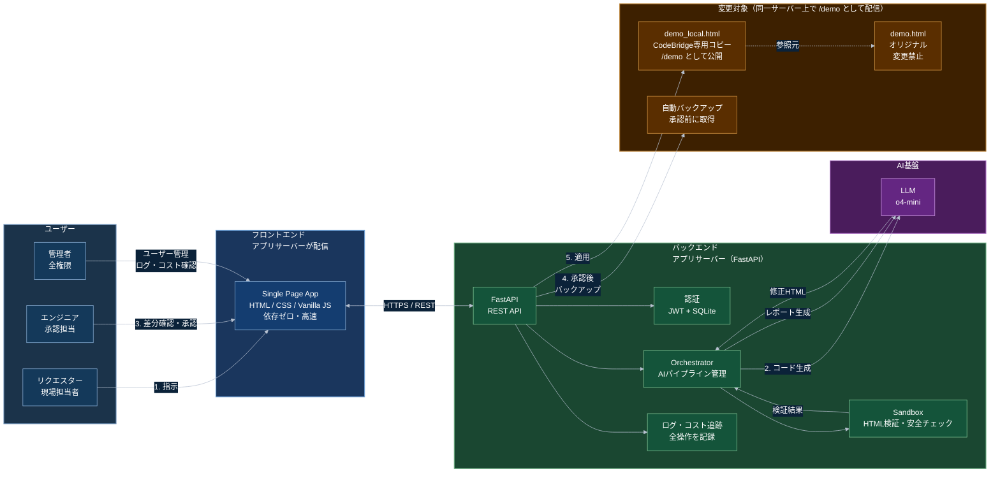
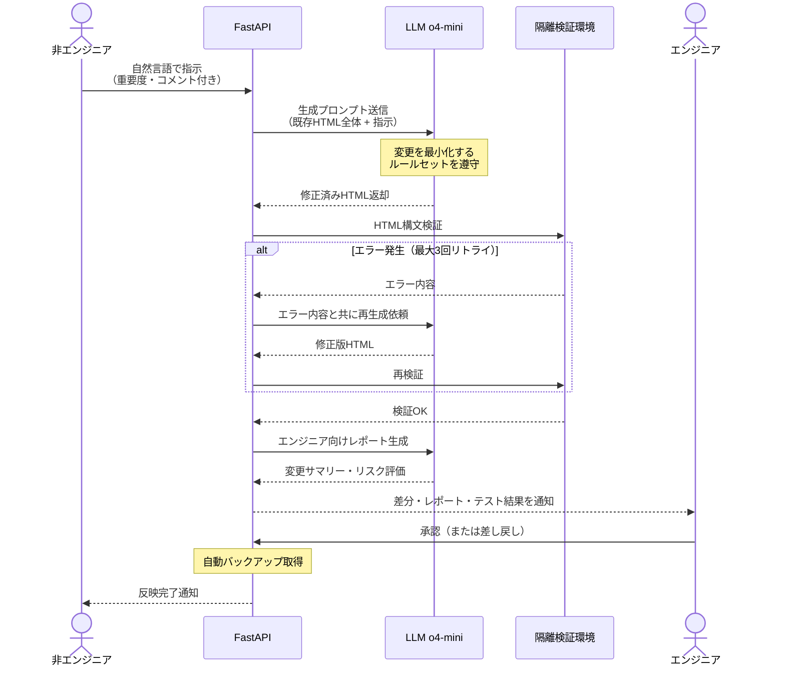
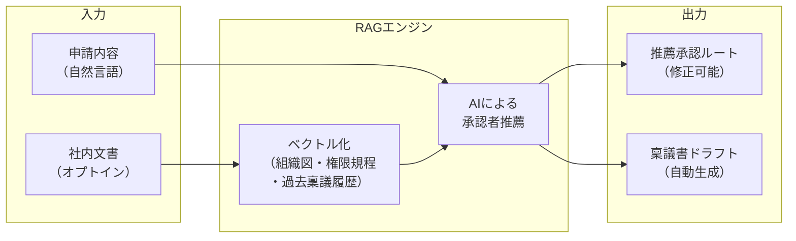

# CodeBridge 「稟議」を再設計するAIエージェント

> AI生成ステップはサンプル応答に差し替えています。

## 構造的な非対称性を再設計する

日本の組織には、特有の構造的な非対称性があります。

現場担当者がシステムを修正したい時、実際に変更できるのはエンジニアであり、エンジニアは常に別のタスクを抱えています。エンジニアに依頼が届いた後もベンダーへの発注・要件定義・開発・テストというプロセスが待ち構え、小さな変更でも数週間から数ヶ月かかることは珍しくありません。

これに加えて、日本固有の障壁が**稟議**です。

稟議書の「申請から決裁までの平均日数」について、株式会社エイトレッドが実施した調査では、**約半数（50.5%）が3日以上**かかると回答しています。さらに**約8割が稟議フローに何らかの悩みを持ち**、最多の悩みは「承認までに時間がかかる」（60.5%）です。

この数字は「仕事を動かしたい人」と「承認できる人」の間に、構造的・文化的な遅延がある事実を示しています。

**CodeBridgeが目指すのは、ここに時間や無駄な手間をかけず、「変更案の生成」「検証」「承認者への提示」「記録」までを進めることです。**

## CodeBridgeとは
CodeBridgeは3つの段階でプロトタイプを実装しています。
- **Phase 1：承認型コード変更**
  自然言語指示を受け取り、AIが既存HTMLを最小変更しエンジニア承認後に反映
- **Phase 2：稟議フロー統合**
  コード依頼に限らず組織内の申請を扱い、承認者推薦・稟議原稿・承認種別を判定
- **Phase 3：意思決定ログ分析**
  承認履歴を蓄積し、「どの種類の申請が滞留しているか」「誰の承認で止まりやすいか」「どの申請は自動化できるか」を可視化し最適化を提案

本番運用にはより強固なセキュリティが必要です。CodeBridgeは**組織の意思決定をAIエージェントがどこまで安全に補助できるか検証する**ため、最小限で一連の流れを動く形で実装しました。

## デモ動画

https://github.com/user-attachments/assets/75316cd5-bce9-46c3-8654-17c886c54406

デモでは以下のフローを実演しています。
1. 日本語でシフト管理システムの修正依頼を入力
2. AIがHTMLを修正・検証
3. エンジニアが差分とAIレポートを確認して承認
4. リアルタイムでシステムを更新

## デモ

### オンラインデモ
 **https://codebridge-ringi.onrender.com**

ブラウザで開いて、下記のテストアカウントでそのままログインできます（無料ホスティングのため、初回アクセス時は起動に30〜60秒ほどかかる場合があります）。

- **ログイン情報（テスト用）**
  - 管理者：`admin@codebridge.ai` / `Admin1234!`
  - エンジニア承認者：`manager@codebridge.ai` / `Manager1234!`
  - 申請者：`staff@codebridge.ai` / `Staff1234!`

### ローカル起動
```bash
git clone https://github.com/t-k-haru/CodeBridge.git
cd CodeBridge
pip install -r requirements.txt

# DEMO_MODE はデフォルトON（LLMを呼ばずサンプル応答 → 課金0円）
uvicorn api_main:app --host 0.0.0.0 --port 8000
```
ブラウザで `http://localhost:8000` を開きます。

- [**GitHubリポジトリ**](https://github.com/t-k-haru/CodeBridge)

> 実際にLLMを動かす場合は `.env` に `DEMO_MODE=0` とお使いの LLM API キーを設定します（変数名は [.env.example](.env.example) を参照）。

## CodeBridgeが埋める「空白地帯」
CodeBridgeが取り組んでいる問題は、**組織の中で誰が変更を望み、誰が判断し、誰が承認し、その記録をどう残すか**です。

AIコーディングエージェント（Copilot、Cursor）は強力ですが、利用者はエンジニアです。
ワークフローSaaS（kintone、楽楽精算）は承認を回しますが、承認結果をシステム変更に接続しません。
個人向けAIエージェント（Claude Cowork）は個人の生産性を上げますが、組織の責任構造には触れません。

Coworkは**個人の生産性ツール**です。CodeBridgeは**組織の意思決定インフラ**です。この2つは競合せず、むしろCoworkのようなAIエージェントが普及した世界でこそ、「誰が最終的に承認するか」という問いの重要性が増します。

## CodeBridgeはなぜAIエージェントか
CodeBridgeをエージェントと呼ぶときに強調したいのは、各ステップで**AIが状況を読み、次の行動を自分で選んでいる**点です。

**コード生成における判断：**
検証でエラーが返ったとき、AIはエラーの種類を分類します。「HTMLの構文ミスか」「指示の解釈を誤ったか」「既存の構造と競合しているか」によって、修正のアプローチが変わります。単に同じプロンプトを再送するのではなく、エラー内容を文脈として読み直した上で、修正方針を変えて再生成します。

**承認フローにおける判断：**
申請文を受け取ったとき、AIは内容を読んで承認タイプを決定します。「金額が規定内で前例があるか」「組織横断の合意が必要か」「リスクの判断が求められるか」によって、通知先・稟議書のトーン・エスカレーションの要否が変わります。

これは「条件が一致したらAをする」という自動化とは異なります。自然言語で書かれた申請の意図を読み取り、組織の文脈に照らして適切な行動経路を推論します。

## 稟議の本質
「稟議を廃止すべき」という議論は的外れだと思っています。なぜなら、稟議には本質的な価値があるからです。

- **合意形成**：関係者全員が実行前に納得済みのため、実行フェーズが速い
- **監査証跡**：誰がいつ何を承認したかが記録として残る
- **責任の明確化**：個人の独断ではなく、組織の意思として決定が記録される
- **周知機能**：関係部署が必ず目を通すため、情報共有を兼ねる

問題は稟議そのものではなく、本来の目的から乖離した「形式化した稟議」にあります。
ワークスアイディ社の分析は、承認行為を以下に分類して構造を明らかにしています。
- **判断型承認**：文脈・リスク・例外を読み解く。これは人間の役割
- **確認型承認**：規則・基準への適合確認。これはAIで代替可能

そして、**業務フローの約8割は「確認型承認」に分析される**といいます。

CodeBridgeの設計思想はここにあります。確認型承認では、AIが規則・基準・過去の類似申請をもとに判断材料を整理します。人間は、例外・リスク・責任判断が必要な承認に集中できます。稟議を廃止するのではなく、**稟議の手間を減らします**。

### 重要なのは「責任の所在」
AIの業務利用において重要なのは、**AIが生成した変更に対して、誰が責任を持つか**です。これが曖昧なツールは、どれだけ便利でも保守的な組織に導入されません。

CodeBridgeはあくまで**提案者**です。AIがコードを生成しても、それだけでは本番に反映されません。実際の流れは次の通りです。
```
担当者が変更を依頼
        ↓
AIが変更案を生成
        ↓
サンドボックスで検証
        ↓
エンジニアに差分・レポート・テスト結果を提示
        ↓
エンジニアが承認
        ↓
反映
        ↓
承認者・時刻・変更内容をログに保存
```

つまり、**「AIが勝手にシステムを変えた」という状況は構造上発生しません。**
AIが自律的に動けば動くほど、「どこまでをAIに任せ、どこからを人間が行うか」という境界設計が重要になります。CodeBridgeは、AI生成の精度だけでなく、**AIと人間の責任分界点**を構想の中心に置いています。

## アーキテクチャ


### エージェントパイプラインの流れ



## 実装上の工夫
### 1. 「変更量の最小化」プロンプト設計
Phase 1では、シフト管理システムを対象に以下を実証しました。
「残業45時間超のスタッフを赤字で表示してください」と入力するとAIは既存のHTML全体（約55,720バイト）を読み込み、変更箇所のみを修正します。実際の差分は4バイトでした。55,720バイトの文脈を理解した上で、4バイトだけ変える。これが「変更量の最小化」の設計原則です。
````python
SYSTEM_PROMPT = (
    "You are an expert frontend engineer. "
    "Rules: "
    "1) Only change what is explicitly requested. "
    "2) Keep ALL existing content, structure, CSS, JS, and data intact. "
    "3) Return the ENTIRE HTML file — do not omit any part. "
    "4) Wrap output in ```html ... ``` block. "
    "5) Preserve Japanese text and existing styles."
)
````
変更量が小さいほどレビューは速くなります。レビューが速ければ承認は形骸化しにくくなります。そして承認が形骸化しなければ、AIを使っても責任の所在を保つことができます。

### 2. 自己デバッグループ
コード生成→検証→エラー→修正というループを最大3回まで自動で実行します。
```python
for i in range(MAX_DEBUG):
    out, err = execute_code(current_html)
    if not err:
        break
    # エラー内容をAIに渡して再生成
    raw = fix_code(current_html, err, instruction)
    current_html = extract_code_block(raw)
```
検証にPythonの`html.parser`を使ったサンドボックスを採用しています。外部ブラウザやNode.jsを立ち上げずに軽量に検証できる点が、サーバー上での安定稼働に寄与しています。

### 3. コスト追跡
「AIを使ったらコストが見えない」という経営層・情シスの懸念は、AI導入の大きな障壁です。リクエスト単位でトークン数とコストを記録し、管理者画面でリアルタイムに確認できる設計にしました。

```python
# o4-mini 概算料金
# Input: $1.10 / 1M tokens
# Output: $4.40 / 1M tokens
def estimate_cost(input_tokens: int, output_tokens: int) -> float:
    return (input_tokens * 1.10 + output_tokens * 4.40) / 1_000_000
```

### 4. ロールと責任の設計
```
Requester  → 指示送信のみ。コードを見ない
Engineer   → 差分確認・承認・差し戻し・コスト閲覧
Admin      → 全機能 + ユーザー管理 + 活動ログ + コスト管理
```
この設計の核心は「責任の帰属を明確にすること」です。AIが生成したコードは、エンジニアが承認して初めて本番に反映されます。承認したエンジニアの名前・日時はすべてログに残ります。

### 5. AI修正対象も同一インフラで配信
従来のプロトタイプではAIが書き換える対象HTMLを外部ホスティングに置いていましたが、本実装ではアプリサーバー上の `/demo` エンドポイントとして配信します。

- 承認直後にエンドユーザーが**リロード一発で変更を反映確認できる**
- 認証・APIサーバー・修正対象がすべて単一インスタンスで完結
- キャッシュ無効化ヘッダー（`Cache-Control: no-cache, no-store, must-revalidate`）付きで配信し、差分の即時確認体験を保証

この設計により、デモから本番運用までのギャップが小さくなり、「動作確認した状態がそのまま運用設計のたたき台になる」体験を実現しています。

## Phase 2：稟議フロー統合の現在地
稟議は組織のあらゆる意思決定に存在します。CodeBridgeのPhase 2では、承認フローを稟議文化と統合し、コーディング以外にも拡張するプロトタイプを実装しました。

### 「廃止」ではなく「手間を除去する」
稟議の本質的価値（合意形成・記録・責任明確化）は保ちながら、**「誰に承認を求めるかを調べる手間」「申請書を書く手間」「進捗を追う手間」**を改善します。

### 現在動いている機能
承認者の自動特定は、申請内容と利用可能な承認者の役割を読み解いて1名を推薦します。

申請内容に応じて、AIが以下を生成します。
```
入力：
「来月から残業管理ルールが変わるため、45時間を超えたスタッフを赤字で表示したい」

出力：
- 申請タイトル・申請理由・変更内容
- 想定される影響・リスク
- 承認者候補
- 承認タイプ（確認型／通知型／判断型／合議型）
- エンジニア向け確認ポイント
```

### 承認者推薦の現状と、RAGによる将来構想

利用可能な承認者リストをLLMに渡し、申請内容と各承認者の役割から最適な1名を推薦しています。理由付きでUIに提示し、申請者は任意で変更可能です。社内の組織図・職務権限規程・過去の稟議履歴をベクトルデータベースに格納し、RAGで承認ルートを精緻化することを構想しています。

### 承認タイプの自動判別
すべての申請が同じ重みを持つべきではありません。AIが申請内容と社内基準を照合し、承認タイプを自動判別します。

| 承認タイプ | 判定基準（例） | CodeBridgeの処理 |
|---|---|---|
| **確認型** | 金額が規定内・前例あり・リスク低 | AIが確認ポイントを整理、記録のみ |
| **通知型** | 情報共有のみ・決定は不要 | 関係者に自動通知、ワンクリック確認 |
| **判断型** | 例外・高額・新規・リスクあり | 担当者に個別通知、期限付き承認依頼 |
| **合議型** | 組織横断・契約・重要投資 | 並列または直列に複数承認者へ通知 |

ワークスアイディの分析によれば業務承認の約8割は確認型です。その8割をAIが補助することで、人間は本当に判断が必要な2割に集中できます。

### コーディング以外への拡張
この仕組みは「コードの変更」に限定する理由がありません。
```
「Slackを新しく導入したい」
  → AIが稟議書ドラフトを生成
  → IT部門・情報セキュリティ・経理・部長へ自動的に承認依頼
  → 全員の承認が完了したらSlack管理者に通知

「来月の東京出張を申請したい」
  → 日程・目的・費用見積もりをAIが整理
  → 直属上長へ承認依頼
  → 規定内なら確認型として処理、超過なら役員承認へエスカレーション

「新しい採用候補者を内定したい」
  → 選考記録をAIが要約
  → 採用担当・部門長・人事部長へ承認依頼（合議型）
```
これはコーディングエージェントではなく、**組織の意思決定インフラ**です。

## Phase 3：意思決定ログ分析プロトタイプの現在地
Phase 3では、申請・承認・差し戻し・コストのログ蓄積と集計表示を実装しました。将来的な予測分析やボトルネック推薦は今後の課題です。

多くの組織では、承認が遅いことは感覚的に分かっていても、どこで詰まっているのかを定量的に把握できていません。
- どの種類の申請が多いのか
- どの承認タイプで時間がかかっているのか
- 誰の承認待ちで滞留しやすいのか
- 差し戻しが多い申請にはどんな傾向があるのか
- AIに任せられる確認型承認はどれくらいあるのか

たとえば、ある種類の申請が毎回承認されており、差し戻しもほとんど発生していない場合、それは将来的に確認型承認として自動化できる候補になります。承認ログは、監査のためだけに残すものではありません。組織のボトルネックを発見するためのデータでもあります。

## セキュリティについて
CodeBridgeは組織のシステム変更に関わるため、セキュリティ設計は非常に重要です。今回の実装では次の方針を取りました。

> **本番品質の完全な防御ではなく、どこに境界を置くべきかを検証できる構造を作る。**

現時点で実装している安全策は以下です。
- AIは本番DBに直接アクセスしない
- 変更対象はCodeBridge専用コピーに限定する
- 承認前には反映しない
- 反映前に自動バックアップを取得する
- 差分・AIレポート・検証結果を承認者に提示する
- 承認者・時刻・変更内容をログに残す
- RequesterはコードをAIも含めて直接編集できない
- EngineerまたはAdminのみが承認できる

本番導入に向けては以下の課題があります。
- gVisor等によるサンドボックス隔離の強化
- Prompt Injection対策
- 監査ログの改ざん耐性
- RBACの強化・SSO連携
- 社内文書RAGのアクセス制御

本実装はPoCであり、本番導入に向けてgVisor等によるカーネルレベルの隔離強化をロードマップに含めています。今回まず検証したかったのは「AIが提案し、人間が承認し、記録が残り、組織が後から検証できる」という構造です。この構造が成立することを確認した上で、セキュリティレイヤーを積み上げるのが現実的な順序だと考えています。

## なぜ日本の保守的企業でも導入できるか
日本の大企業・中堅企業がAI導入を躊躇する理由は、大きく4つに整理できます。CodeBridgeはそれぞれに設計で答えます。

### ① 「AIが間違えたら誰が責任を取るか」
承認者が責任を持ちます。AIは「提案者」であり、実行するのは常に「承認したエンジニア」です。承認の記録は保存されます。

### ② 「社内情報をクラウドに上げるのが怖い」
変更対象はローカルコピーのHTMLファイルのみです。本番データベースには直接AIが触れません。社内文書のRAG連携は完全オプトインで、使わなくても機能します。利用するLLM APIは、企業向け契約時にはデータをモデルの学習に使用しない構成を選べます。

### ③ 「コストが見えない」
リクエスト単位でトークン数とコストを記録します。今月のAI利用料が管理者画面でリアルタイムに表示されます。

### ④ 「既存のベンダーとの関係がある」
既存システムを置き換えません。現在動いているHTML・Webシステムの「上に被せる承認レイヤー」として機能します。既存ベンダーとの契約を維持しながら、変更スピードだけを向上させます。

## おわりに：「稟議」の再設計
稟議に代表される日本の承認文化を「非効率」として切り捨てるのは簡単です。しかし承認には、組織の合意・記録・責任という本質的な価値があります。問題は目的を達成するために必要な手間と、形式化によって生まれた「無駄な手間」が区別されないことです。

CodeBridgeはその境界を引くためのツールです。確認型承認はAIが補助し、稟議書の下書きを生成し、承認者の候補を提示する。
エンジニア不足が深刻化し続ける現場で、「すべてをエンジニアが抱える構造」にも「すべてをAIに任せる構造」にも限界があります。必要なのは、AIと人間の責任分界点を設計すること。その問いにCodeBridgeは今後も向き合い続けます。

## 技術スタック

| 層 | 技術 | 選定理由 |
|---|---|---|
| フロントエンド | HTML/CSS/Vanilla JS | 依存ゼロ・即時反応・モバイル対応 |
| バックエンドAPI | FastAPI（Python 3.11） | 高速・型安全・OpenAPI自動生成 |
| 実行環境 | Render（Docker / 無料枠） | 無料・GitHub連携で自動デプロイ・HTTPS自動付与 |
| AI | LLM（o4-mini） | 推論品質・コストのバランス |
| 認証 | JWT + SQLite | 軽量・移行容易・PoC適切 |
| サンドボックス | Python subprocess + html.parser | 外部依存ゼロ・軽量・日本語対応 |
| ログ・コスト | SQLite | 永続化・CSV出力・リアルタイム閲覧 |

## 参考資料
- [エイトレッド「稟議書に関する実態調査」](https://prtimes.jp/main/html/rd/p/000000088.000050743.html)
- [ワークスアイディ「AIエージェント時代に『承認』はどう変わる？」](https://dx.worksid.co.jp/content/ai-agent-approval/)
